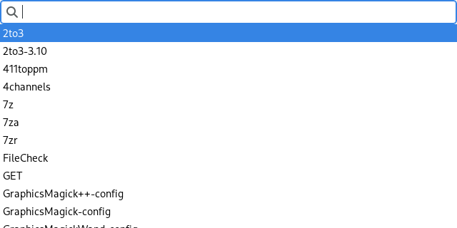

# zofi

A straightforward Wayland application launcher similar to rofi and dmenu.

## Building

- GTK 3
- gtk-layer-shell
- pkg-config
- The latest version of Zig

Run `zig build` to build zofi. The executable is placed at `zig-out/bin/zofi`.
See [this link](https://ziglang.org/documentation/master/#Build-Mode) for
building an optimized binary. To see all available options, run
`zig build --help`.

## Usage

zofi runs in Wayland compositors that support the layer shell protocol. You can
use `wayland-info` within a compositor to check for support.

To use zofi, enter a command and press enter to run it. If your command matches
an executable on the PATH, you can select it from a list of suggestions by
pressing up and down, and pressing enter to run the highlighted program. Press
tab with an executable selected to insert the full executable name into the
command bar, allowing you to add command-line parameters. Press escape to close
zofi without running anything.

## Configuration

zofi uses GTK 3, so most graphical elements of zofi are configured directly by
your GTK 3 theme. The size of the window can be specified using command-line
arguments. Run `zofi -h` for more information.

## License

zofi is licensed under the MIT License.
